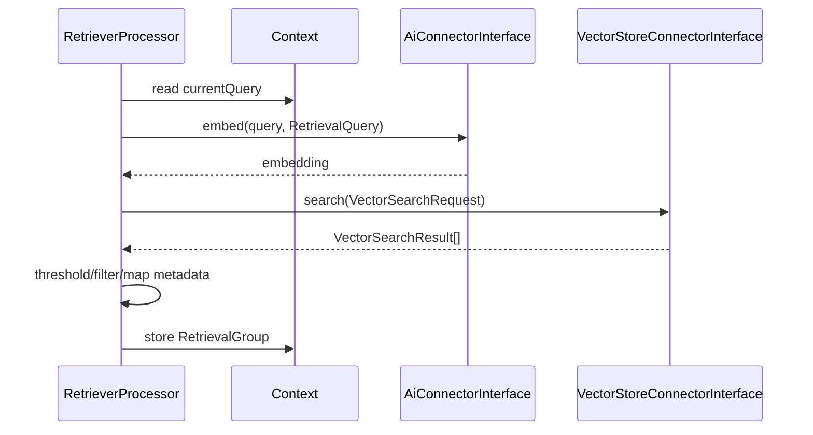

# Retrieval

The default retrieval path is implemented by `RetrieverProcessor` and is provider-independent.

## Retrieval flow



## Connection resolution

A retriever can use a vector-store connection configured specifically on the step. If not provided, the assistant-level vector-store connection is used.

The collection is resolved from the step and connection defaults. `canProcess()` requires:

- non-empty `currentQuery`;
- a vector-store connection;
- a resolvable non-empty collection.

## Query embedding

The assistant AI connection is used to create the query embedding with:

```php
new EmbeddingRequest(
    text: $context->getCurrentQuery(),
    purpose: EmbeddingPurpose::RetrievalQuery,
)
```

Thus the embedding provider is resolved independently of the vector store.

## Vector search

The default retriever builds a `VectorSearchRequest` with:

- configured collection;
- query vector;
- `maxRetrievalResults` as limit;
- payload enabled;
- vectors disabled in the response;
- named vector equal to the collection;
- search params containing `hnsw_ef = 128` and `exact = false`.

After the vector store returns results, `scoreThreshold` is applied in the processor.

## Retrieval groups

A retrieval is stored as a `RetrievalGroup` rather than flattening everything immediately. The group carries information such as:

- identifier;
- processor identifier;
- query;
- collection;
- retrieved documents;
- normalized raw results;
- context limits.

This makes multi-retrieval pipelines possible and preserves attribution in prompt construction.

## Answer context

Raw retrieval documents can be turned into prompt text directly. If a `ContextOptimizerProcessor` runs, it writes a condensed `answerContext` to `RetrievalResult`. Answer-generating steps can then consume that optimized context.

## Retrieval memory

Retrieval state is **not automatically persisted by the orchestrator**.

Two explicit memory processors are provided:

- `aiassistant.memory.retrieval_write` stores the current retrieval state as the last retrieval result for the chat;
- `aiassistant.memory.retrieval_read` restores that stored state into a later pipeline run.

This keeps follow-up retrieval reuse visible in pipeline configuration and avoids hidden cross-turn behavior.
